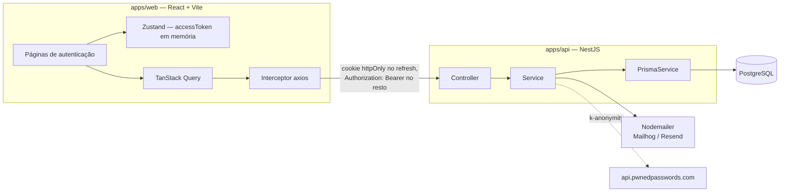
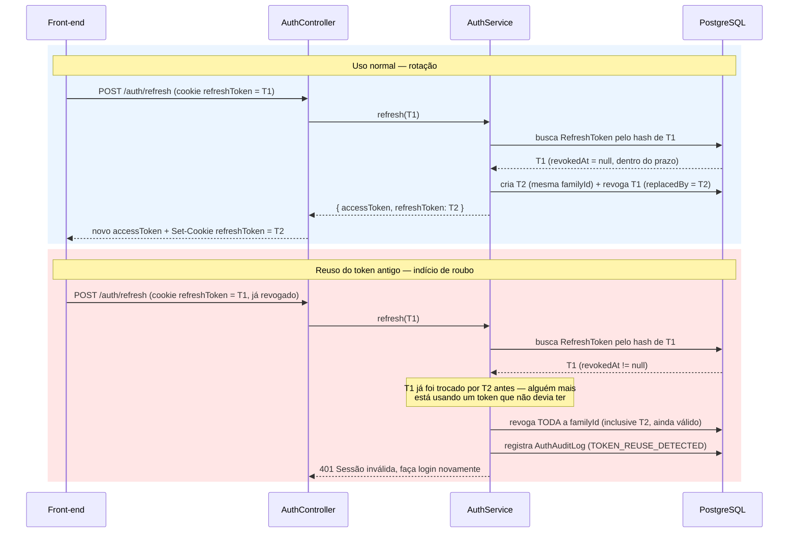
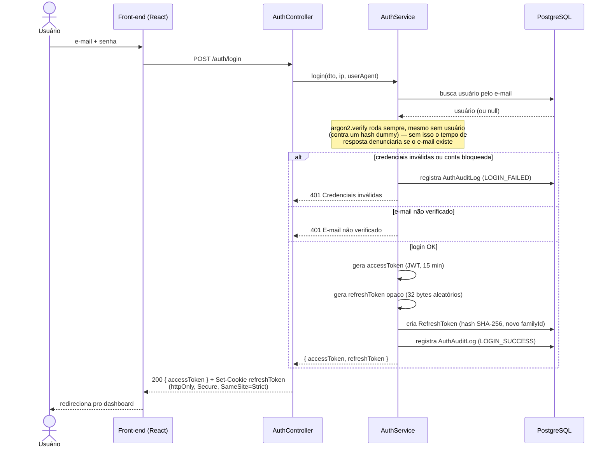
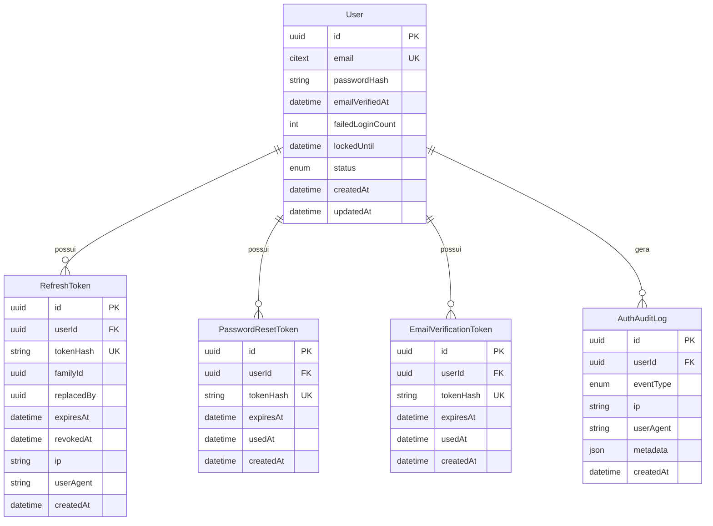

# Arquitetura

Este documento descreve as decisões estruturais e de segurança do
**auth-system**: por que o sistema foi montado da forma como está, não
apenas o que cada arquivo faz. Para instruções de uso, veja o
[README.md](./README.md).

## Visão geral



Fluxo de camadas no back-end, por módulo (`src/modules/{auth,users,mail,hibp}`):

```
HTTP Request → Controller (fino) → Service (regra de negócio) → PrismaService → PostgreSQL
```

- **Controller**: só recebe `Body`/`Query`/`Cookie`, chama o Service e devolve a resposta. Nunca acessa o Prisma diretamente.
- **Service**: toda a regra de negócio (hashing, geração/validação de token, lockout, auditoria). Nunca conhece `Request`/`Response`.
- **PrismaService**: `PrismaClient` clássico (`src/prisma/prisma.service.ts`), sem adapter — só `extends PrismaClient` e liga/desliga no ciclo de vida do módulo Nest.

## Decisão central do domínio: refresh token opaco, nunca JWT

O access token é JWT (assinado, sem estado, 15 min) porque seu único
trabalho é provar identidade por uma janela curta. O refresh token é
**intencionalmente o oposto**: um valor opaco (`crypto.randomBytes(32)`),
porque ele precisa ser **revogável** — e um JWT não pode ser revogado antes
de expirar sem manter uma lista de negação em algum lugar, o que anula a
vantagem de ser stateless. Só o hash SHA-256 do refresh token vive no
banco; o valor bruto nunca é persistido, só devolvido ao cliente uma vez,
dentro de um cookie `httpOnly`.

### Rotação + detecção de reuso

Cada `RefreshToken` carrega um `familyId` (compartilhado por todos os
tokens da mesma sessão) e um `replacedBy` (aponta pro token que o
sucedeu). A cada `/auth/refresh`, o token apresentado é revogado e um novo
é criado na mesma family — nunca existe mais de um refresh token "vivo"
por sessão.

Isso é o que permite detectar roubo: um refresh token revogado só volta a
ser apresentado se **outra parte** (o dono legítimo, ou o atacante que
roubou o cookie) tiver uma cópia antiga. Não importa qual dos dois é —
reapresentar um token já revogado é, por definição, prova de que a rotação
não está sendo respeitada, então a resposta correta é matar a sessão
inteira (toda a `family`), forçando um novo login. É melhor deslogar o
usuário legítimo por engano do que deixar uma sessão comprometida viva.



### Login — visão de ponta a ponta



## Modelo de dados



`email` usa `citext` (comparação case-insensitive nativa do Postgres) para
que `Usuario@Exemplo.com` e `usuario@exemplo.com` sejam a mesma conta sem
precisar normalizar manualmente em toda query.

## Anti-enumeração de usuário

`register`, `login`, `forgot-password` e `resend-verification` devolvem a
**mesma resposta genérica** independentemente de o e-mail existir, já
estar verificado, ou estar bloqueado. Isso só funciona se o _tempo_ de
resposta também for uniforme — por isso o `argon2.verify` roda mesmo
quando não há usuário (contra um hash dummy pré-computado), e por isso
`resendVerification`/`forgotPassword` fazem exatamente as mesmas
operações de banco em qualquer ramo, só variando se o e-mail é
efetivamente enviado.

## Rate limiting e lockout — duas defesas em camadas diferentes

- **Rate limit** (`@nestjs/throttler`, armazenamento em memória) limita
  por **IP**, sem olhar pra conta: barra automação/scraping bruto.
- **Lockout progressivo** (`failedLoginCount` + `lockedUntil` no próprio
  `User`) persiste por **conta**, sobrevive a troca de IP e escala:
  1 min → 5 min → 30 min → 1h → 24h a cada bloco de 5 falhas adicionais.

O armazenamento do throttler é em memória de propósito — é uma
simplificação deliberada para deploy de instância única. Um cenário
multi-instância exigiria um backend compartilhado (ex.: Redis) pro
throttler; o `docker-compose.yml` já sobe um serviço `redis` local pra
essa extensão futura, mas ele **não está** conectado a nada hoje — o
lockout por conta (que é o que realmente importa contra
credential-stuffing) já vive no Postgres e é imune a essa limitação.

## Testes

Três camadas, cada uma com um propósito diferente:

1. **Unitários** (`src/**/*.spec.ts`) — cobrem `AuthService` com todas as
   dependências mockadas (Prisma, Mail, HIBP, JWT). Rápidos, cobrem
   regra de negócio e casos de erro.
2. **E2E mockado** (`test/*.e2e-spec.ts`) — sobem a aplicação Nest de
   verdade (guards, pipes, DTOs, cookies) mas com Prisma/Mail/HIBP
   mockados. Cobrem a camada HTTP sem depender de infraestrutura.
3. **E2E real** (`test/*.e2e-real.spec.ts`, comando `npm run
test:e2e:real` em `apps/api`) — sobe a aplicação com **Postgres real**,
   isolado num banco só de teste (`auth_system_test`, nunca o de
   dev/produção — ver guarda explícita no início do arquivo de teste).
   Só e-mail e HIBP continuam mockados. Percorre o fluxo crítico completo:
   `register → verify → login → refresh (rotação) → reuse detection →
reset`. É a suíte que roda no CI contra um serviço Postgres efêmero.

## Decisões que ficaram de fora (e por quê)

- **Sem Redis para o throttler**: ver seção acima — não compensava a
  complexidade extra pro escopo de um projeto de portfólio single-instance.
- **Sem refresh token como JWT**: JWT não é revogável sem uma lista de
  negação; um valor opaco hasheado no banco já resolve isso de forma mais
  simples.
- **Sem enumeração por status HTTP diferente**: toda a superfície
  register/login/forgot-password/resend-verification devolve 200/201
  genérico; erros específicos (ex.: e-mail não verificado no login) só
  aparecem quando o usuário já provou a senha correta — nesse ponto,
  recusar a informação não protege mais ninguém.
